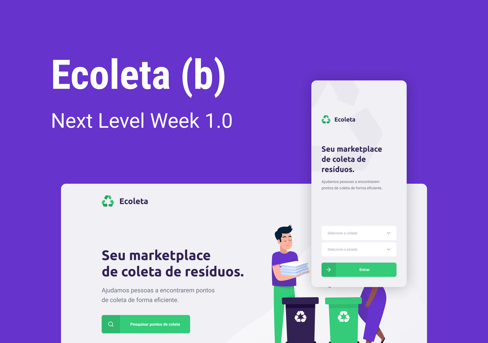

# ♻️ ECOLETA 

 Projeto realizado através da NEXT LEVEL WEEK <b>#1</b> 💜 

 <a href="#-projeto">PROJETO</a> |
 <a href="#-tecnologias">TECNOLOGIAS</a> |
 <a href="#-license">LICENÇA</a>

### 💻 Projeto:

O projeto tem a funcionalidade de conectar usuários à pontos de coletas de resíduos. 
Disponível via web e mobile com todas funcionalidades necessárias.

### 🚀 Tecnologias: 
- Javascript ES6
- ReactJS
- React Native
- Typescript
- NodeJS
- Expo
- Axios
- Knex
- Sqlite3
- Express
- Multer
- Celebrate
- Cors

#### 📜 LICENSE

 Esse projeto está sob a licença MIT. Veja o arquivo [MIT LICENSE](LICENSE.md) para mais detalhes.

-----------------------------

 feito com 💜 vamos manter o contato? 🖐 <a href="https://www.linkedin.com/in/hedenica/">clique aqui</a> 

